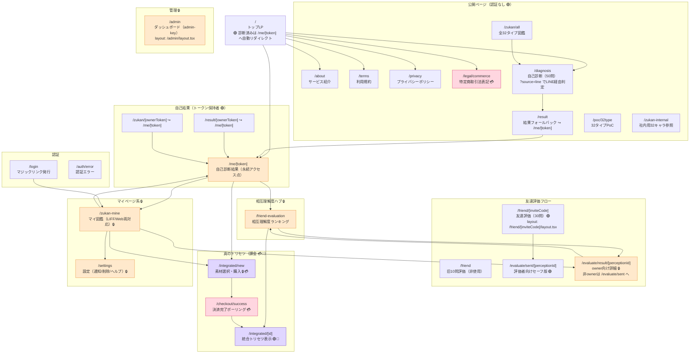
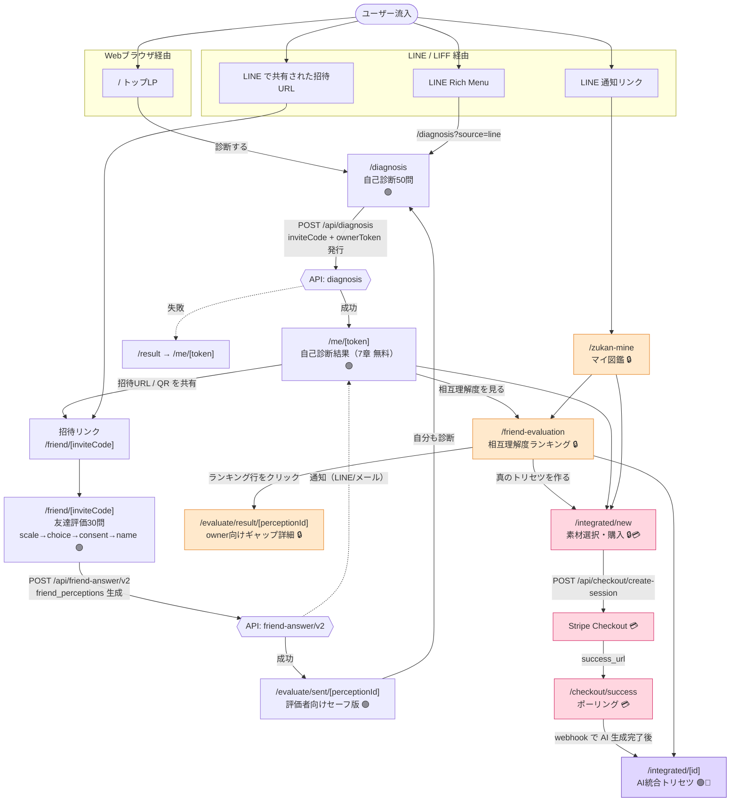
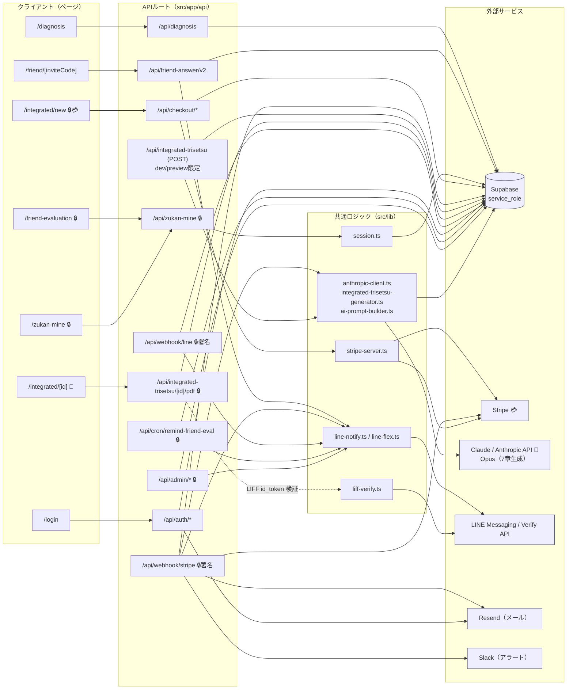

# ワタシのトリセツ サイト構造

> 実際のコード（`src/app` / `src/lib`）を走査して作成。推測は含めず、確認できたルート・処理のみを記載。
> 調査時点のブランチ: `feature/top-redesign` / 生成日: 2026-06-19

## 凡例

| 印 | 意味 |
| --- | --- |
| 🔒 | 認証必須（Cookie セッション `wn_session` / owner 確認 / admin-key / 署名検証のいずれか） |
| 💳 | 課金が絡むページ・処理（Stripe Checkout） |
| 🤖 | Claude（Anthropic）API を呼ぶ処理 |
| 🟢 | 認証なしで誰でもアクセス可（URL/トークンを知っていれば閲覧可） |
| ↪️ | リダイレクト（互換用） |

---

## ① ページルート全体のサイトマップ

`src/app` 配下の `page.tsx` から確認できた全ページルート。`layout.tsx` の階層も反映。

### ルート一覧（確認済み）

**ページ（`page.tsx`）**

| ルート | layout | 認証 | 備考 |
| --- | --- | --- | --- |
| `/` | `app/layout.tsx`（ルート） | 🟢 | 診断済みなら `/me/[token]` へ自動リダイレクト（`?stay=1` で回避） |
| `/about` `/terms` `/privacy` `/legal/commerce` | ルート | 🟢 | 静的ページ。`/legal/commerce` は特商法表記💳 |
| `/diagnosis` | `app/diagnosis/layout.tsx` | 🟢 | 自己診断50問。`?source=line` でLINE Rich Menu経由判定 |
| `/result` | `app/result/layout.tsx` | 🟢 | フォールバック → `/me/[token]` |
| `/result/[ownerToken]` | `app/result/layout.tsx` | 🟢 | ↪️ `permanentRedirect` → `/me/[token]`（旧URL互換） |
| `/me/[token]` | ルート | 🟢 | 自己診断結果の永続アクセス点（7章すべて無料表示） |
| `/friend` | `app/friend/layout.tsx` | 🟢 | 旧10問評価（現フローでは未使用） |
| `/friend/[inviteCode]` | `app/friend/[inviteCode]/layout.tsx` | 🟢 | 友達評価30問（メインフロー） |
| `/friend-evaluation` | ルート | 🔒 | 相互理解度ランキングハブ（`getSession` 必須） |
| `/evaluate/sent/[perceptionId]` | ルート | 🟢 | 評価者（友達）向けセーフ版 |
| `/evaluate/result/[perceptionId]` | ルート | 🔒 | owner専用詳細。非ownerは `/evaluate/sent` へ |
| `/perceptions/[ownerToken]` | `app/perceptions/[ownerToken]/layout.tsx` | — | 知覚一覧（layout あり） |
| `/report/[ownerToken]` | `app/report/layout.tsx` | 🟢 | 深掘りレポート |
| `/integrated/new` | ルート | 🔒💳 | 素材選択・Stripe Checkout 開始 |
| `/integrated/[id]` | ルート | 🟢🤖 | AI統合トリセツ表示（シェアリンク前提） |
| `/checkout/success` | ルート | 🟢💳 | 決済完了ポーリング → `/integrated/[id]` |
| `/zukan/[ownerToken]` | `app/zukan/layout.tsx` | 🟢 | ↪️ `permanentRedirect` → `/me/[token]` |
| `/zukan/all` | `app/zukan/layout.tsx` | 🟢 | 全32タイプ図鑑 |
| `/zukan-mine` | ルート | 🔒 | マイ図鑑（Cookie セッション、LIFF/Web両対応） |
| `/me`, `/settings` | ルート | 🔒 | 設定（通知/削除/ヘルプ） |
| `/login` | ルート | 🟢 | マジックリンク発行 |
| `/auth/error` | ルート | 🟢 | 認証エラー表示 |
| `/admin` | `app/admin/layout.tsx` | 🔒 | 管理ダッシュボード（admin-key） |
| `/poc/32type`, `/zukan-internal` | ルート | 🟢 | 社内/PoC用 |

**APIルート（`route.ts`）— 別枠**

| APIルート | メソッド | 認証/署名 | 外部サービス |
| --- | --- | --- | --- |
| `/api/diagnosis` | POST | checkOrigin | Supabase |
| `/api/result` | — | owner_token / invite_code | Supabase |
| `/api/friend-info` | — | checkOrigin | Supabase |
| `/api/friend-answer` | POST | checkOrigin | Supabase + LINE |
| `/api/friend-answer/v2` | POST | checkOrigin | Supabase + LINE + Resend |
| `/api/report` | — | owner_token / sample / adminKey | Supabase |
| `/api/event` | POST | checkOrigin | Supabase |
| `/api/user` | PATCH | checkOrigin + ownerToken | Supabase |
| `/api/zukan` | — | owner_token | Supabase |
| `/api/zukan-mine` | GET | 🔒 Cookie セッション | Supabase |
| `/api/integrated-trisetsu` | POST | 🔒 セッション・dev/preview限定（本番は410）| Supabase + 🤖 Claude |
| `/api/integrated-trisetsu/[id]` | GET | 🟢 | Supabase |
| `/api/integrated-trisetsu/[id]/pdf` | GET | 🔒 セッション + 所有権 | Supabase + react-pdf |
| `/api/checkout/create-session` | POST | 🔒 セッション 💳 | Stripe + Supabase |
| `/api/checkout/create-perception-unlock-session` | POST | 🔒 セッション + 所有権 💳 | Stripe + Supabase |
| `/api/checkout/status` | — | session_id | Supabase |
| `/api/webhook/stripe` | POST | 🔒 Stripe署名 💳🤖 | Stripe + Supabase + Claude + LINE/Resend/Slack |
| `/api/webhook/line` | POST | 🔒 LINE署名 | LINE + Supabase |
| `/api/auth/request-magic-link` | POST | checkOrigin + レート制限 | Supabase + Resend |
| `/api/auth/verify-magic-link` | GET | token | Supabase |
| `/api/account/delete` | — | 🔒 セッション | Supabase + LINE |
| `/api/settings/notifications` | — | 410 Gone（Phase2凍結） | — |
| `/api/session/clear` | POST | checkOrigin | Supabase |
| `/api/cron/remind-friend-eval` | — | 🔒 Cron Bearer | Supabase + LINE |
| `/api/admin/dashboard` `/stats` `/simulate-follow` `/test-line-notify` `/welcome-status` | — | 🔒 x-admin-key | Supabase (+ LINE) |

---

## ② 主要ユーザーフロー（診断 〜 相互理解度 〜 真のトリセツ）

### LIFF（LINEアプリ内）経由 と Web経由 の違い

確認できた範囲では、**ページ自体はほぼ共通**で、入口と一部処理が分岐する。

| 観点 | Web ブラウザ経由 | LINE / LIFF 経由 |
| --- | --- | --- |
| 診断開始 | `/` → `/diagnosis` | LINE Rich Menu → `/diagnosis?source=line`（過去診断ありなら再診断確認モーダル） |
| 友達評価 | 共有URL `/friend/[inviteCode]` を通常ブラウザで開く | 同URLを LINE で共有 → LIFF / 通常ブラウザ双方で動作（ページ側はLIFF非依存） |
| マイ図鑑 | `/zukan-mine`（Cookie `wn_session` で認可） | LINE 通知リンク → `/zukan-mine`（旧: LIFF id_token、現: Cookie セッションに移行） |
| PDF ダウンロード | `/integrated/[id]` のダウンロードボタン | `IntegratedDownloadButton` が LIFF id_token を取得して `/api/integrated-trisetsu/[id]/pdf` を呼ぶ |
| LIFF ID | — | `NEXT_PUBLIC_LIFF_ID`（診断共有） / `_SHARE`（共有ボタン） / `_TORISETSU_REDIRECT`（連携リダイレクト） |

> LIFF id_token の検証は `lib/liff-verify.ts`（LINE Verify API に複数チャンネルIDで順次照会）。ただし主要導線はサーバ側 Cookie セッション（`wn_session`）へ移行済み。

### Stripe 決済が絡む導線（現状の所在）

確認できた決済導線は次の通り。**Checkout は本番稼働、AI生成は webhook で確定**。

1. **真のトリセツ生成（¥500）**: `/integrated/new` → `POST /api/checkout/create-session`（`getPremiumPriceId()` の price で line_items 作成、要セッション・email）→ Stripe Checkout → `success_url=/checkout/success?session_id=...` → ポーリング → `/integrated/[id]`。
2. **友達評価1件アンロック（¥500）**: `POST /api/checkout/create-perception-unlock-session`（所有権確認 + 二重課金防止 409）→ Stripe Checkout。
3. **決済確定**: `POST /api/webhook/stripe`（`stripe.webhooks.constructEvent` で署名検証）→ `checkout.session.completed` で `payment_history` / `integrated_trisetsu` を INSERT → `after()` で 🤖 `runAIGenerationAndUpdate()`（最大100秒）をキック。
4. **ステータス確認**: `/api/checkout/status`（webhook 反映前のポーリング用）。
5. **特商法表記**: `/legal/commerce` 💳。

> 補足: `POST /api/integrated-trisetsu`（手動生成）は **本番（`VERCEL_ENV==='production'`）では 410 を返す** dev/preview 限定の経路（`route.ts:34-42`）。本番の真のトリセツ生成は **Stripe webhook 経由のみ**。

---

## ③ 外部サービス連携図

どのページ / API が、Supabase / Stripe / LINE / Claude / Resend / Slack のどれを呼ぶか。

### 連携サマリ

| 外部サービス | 主用途 | 呼び出し元（確認済み） |
| --- | --- | --- |
| **Supabase**（service_role） | DB全般（users / friend_answers / friend_perceptions / integrated_trisetsu / events / magic_links / line_users 等）。認可後に admin 権限で操作 | ほぼ全 API ルート（`lib/supabase-server.ts` の `supabaseAdmin`） |
| **Claude / Anthropic** 🤖 | 真のトリセツ7章を生成（Opus、max_tokens 16000、parse失敗時リトライ） | `lib/anthropic-client.ts` ← `integrated-trisetsu-generator.ts` ← ①`/api/webhook/stripe`（本番）②`/api/integrated-trisetsu` POST（dev/preview） |
| **Stripe** 💳 | Checkout Session 作成（真のトリセツ・友達評価アンロック）+ Webhook 署名検証・決済確定 | `/api/checkout/*`, `/api/webhook/stripe`（`lib/stripe-server.ts`） |
| **LINE Messaging API** | Push / Flex 通知（welcome / 友達評価到着 / 決済受領 / 統合完成 / リマインド）。feature flag `LINE_NOTIFICATIONS_ENABLED` 制御 | `/api/friend-answer*`, `/api/webhook/*`, `/api/cron/*`, `/api/admin/*`（`lib/line-notify.ts` / `line-flex.ts`） |
| **LINE Verify API** | LIFF id_token 検証（複数チャンネルID順次照会） | `lib/liff-verify.ts` ← PDF ダウンロード等（主要導線は Cookie セッションへ移行済み） |
| **Resend** | メール送信（マジックリンク / 友達評価到着 / 統合完成通知） | `/api/auth/*`, `/api/friend-answer/v2`, `/api/webhook/stripe` |
| **Slack** | 運営者向けエラー / 統計アラート | `/api/webhook/stripe`, generator 失敗時 |

---

## 補足・注意

- 本ドキュメントは `src/app` / `src/lib` の実コードから確認できたルート・処理のみを記載。`/api/settings/notifications` は現状 410（Phase 2 凍結）、`/api/integrated-trisetsu` POST は本番 410（dev/preview 限定）。
- `/friend`（旧10問）はコード上存在するが、現行フローのメインは `/friend/[inviteCode]`（30問）。
- セッションは Cookie `wn_session`（httpOnly / Secure / SameSite=Lax、`lib/session.ts`）。`/api/session/clear` で共用端末から離脱可能。
